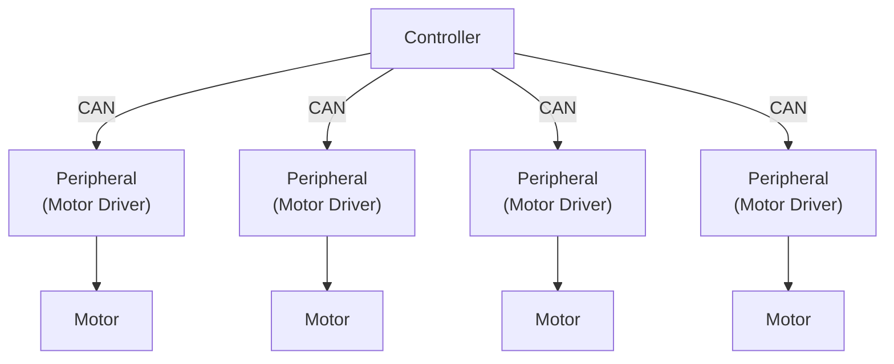

<div align="center">


[](https://github.com/yutotnh/spirit/actions/workflows/build.yml)
[](https://github.com/yutotnh/spirit/actions/workflows/cmake-test.yml)
[](https://github.com/yutotnh/spirit/actions/workflows/codeql.yml)

[](https://github.com/yutotnh/spirit/actions/workflows/dependency-review.yml)
[](https://github.com/yutotnh/spirit/actions/workflows/deploy-static.yml)
[](https://www.codefactor.io/repository/github/yutotnh/spirit)

</div>

# 👻 spirit

モータードライバーを駆動するためのライブラリ

下の図のように、マイコン間の通信を行いモータードライバーを制御することを目的としています



最終的にはMbed/Arduino等での利用を想定していますが、自動テストを非マイコンで行う都合上、可能な限り特定の環境への依存を減らしています

## 💻 Supported platforms

下記の環境では多分動きます

| Platform  |   architecture    |
| :-------: | :---------------: |
|  Arduino  |       ESP32       |
|  Arduino  |     Portenta      |
|  Arduino  | Raspberry Pi Pico |
|  Arduino  |       STM32       |
| Mbed OS 6 |      LPCxxxx      |
| Mbed OS 6 |       STM32       |

## ⌨️ Development

### 🛠️ Build & Test

リポジトリのルートディレクトリで下の手順を行うことで、ビルドからテストの実行ができます

プリセットは `Debug` と `Release` の2種類があります

```shell
cmake -S . --preset Debug    # Configurate & Generate
cmake --build --preset Debug # Build
ctest --preset Debug         # Test
```

テストフレームワークとして Google Test を利用しています

### 🐋 Development Containers

このリポジトリは、Visual Studio Code Dev Containers/GitHub Codespaces を含んでいます

Development Containers を利用することで、本プロジェクトでの開発に必要な最低限の環境を自動的に構築し、直ちに開発に取り組むことができます

使い方等の詳細は、 [Developing inside a Container](https://code.visualstudio.com/docs/devcontainers/containers) をご覧ください

## 📖 Document

Doxygenを使って、ソースコードからドキュメントを生成しています

生成したドキュメントへのリンクは以下です

- [一般ユーザ用](https://yutotnh.github.io/spirit/general)
  - Controller側で利用するAPIのみをまとめたページ
- [開発者用](https://yutotnh.github.io/spirit)
  - Controller/Peripheral側の全てのAPIをまとめたページ(=全部入り)

リポジトリのルートディレクトリで下の手順を行うことで、各ドキュメントの生成ができます

```shell
git submodule update --init                              # For doxygen-awesome-css
doxygen ${workspaceFolder}/doxygen/Doxyfile              # Generate developer documentation for spirit
doxygen ${workspaceFolder}/doxygen/Doxyfile4GeneralUsers # Generate general user documentation
```

## 🤝 Contributing

PullRequestやissueを送る際は、 [CONTRIBUTING.md](./CONTRIBUTING.md) をご覧ください

## 🏃 Using spirit

- 🚧 [yutotnh/spirit-mbed-can-motor-controller](https://github.com/yutotnh/spirit-mbed-can-motor-controller)
  - spirit と CAN を用いた Mbed の モータードライバ制御プログラム(Controller側)
- [yutotnh/spirit-mbed-can-motor-driver](https://github.com/yutotnh/spirit-mbed-can-motor-driver.git)
  - spirit と CAN を用いた Mbed の モータードライバ制御プログラム(Peripheral側)
