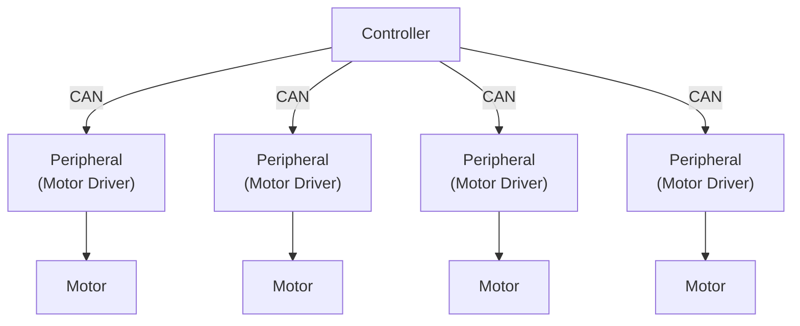

<div align="center">


[](https://github.com/yutotnh/spirit/actions/workflows/build.yml)
[](https://github.com/yutotnh/spirit/actions/workflows/cmake-test.yml)
[](https://github.com/yutotnh/spirit/actions/workflows/codeql.yml)

[](https://github.com/yutotnh/spirit/actions/workflows/dependency-review.yml)
[](https://github.com/yutotnh/spirit/actions/workflows/deploy-static.yml)

</div>

# Spirit

モータードライバーを駆動するためのライブラリ

下の図のように、マイコン間の通信を行いモータードライバーを制御することを目的としています



最終的にはMbed/Arduino等での利用を想定していますが、自動テストを非マイコンで行う都合上、可能な限り特定の環境への依存を減らしています

## ⌨️ Development

### Test

Google Testを使っています

### Build & Test

リポジトリのルートディレクトリで下の手順を行うことで、ビルドからテストの実行ができます

```shell
cmake -S . -B build    # Configurate & Generate
cmake --build build    # Build
ctest --test-dir build # Test
```

### Development Containers

このリポジトリは、Visual Studio Code Dev Containers/GitHub Codespaces を含んでいます

Development Containers を利用することで、本プロジェクトでの開発に必要な最低限の環境を自動的に構築し、直ちに開発に取り組むことができます

使い方等の詳細は、 [Developing inside a Container](https://code.visualstudio.com/docs/devcontainers/containers) をご覧ください

## 📖 Document

Doxygenを使って、ソースコードからドキュメントを生成しています

生成したドキュメントへのリンクは以下です。

- [一般ユーザ用](https://yutotnh.github.io/spirit/general)
  - Controller側で利用するクラス等のみをまとめたページ
- [開発者用](https://yutotnh.github.io/spirit)
  - Controller/Peripheral全て入ったページ(=全部入り)

## 🤝 Contributing

PullRequestやissueを送る際は、 [CONTRIBUTING.md](./CONTRIBUTING.md) をご覧ください

## 🏃 利用例

準備中:construction:
